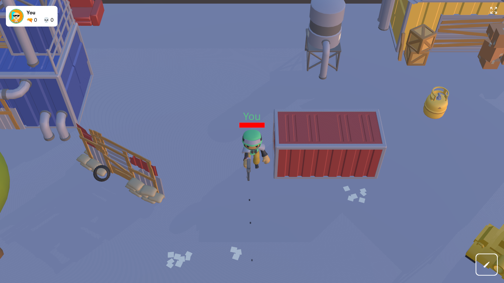
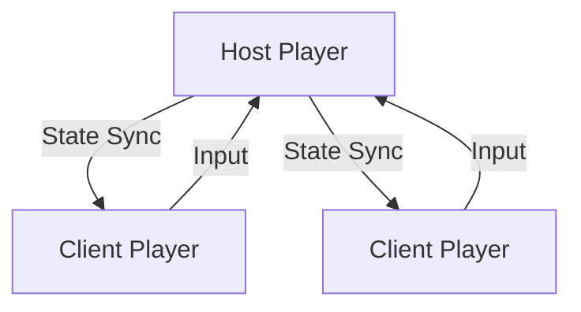
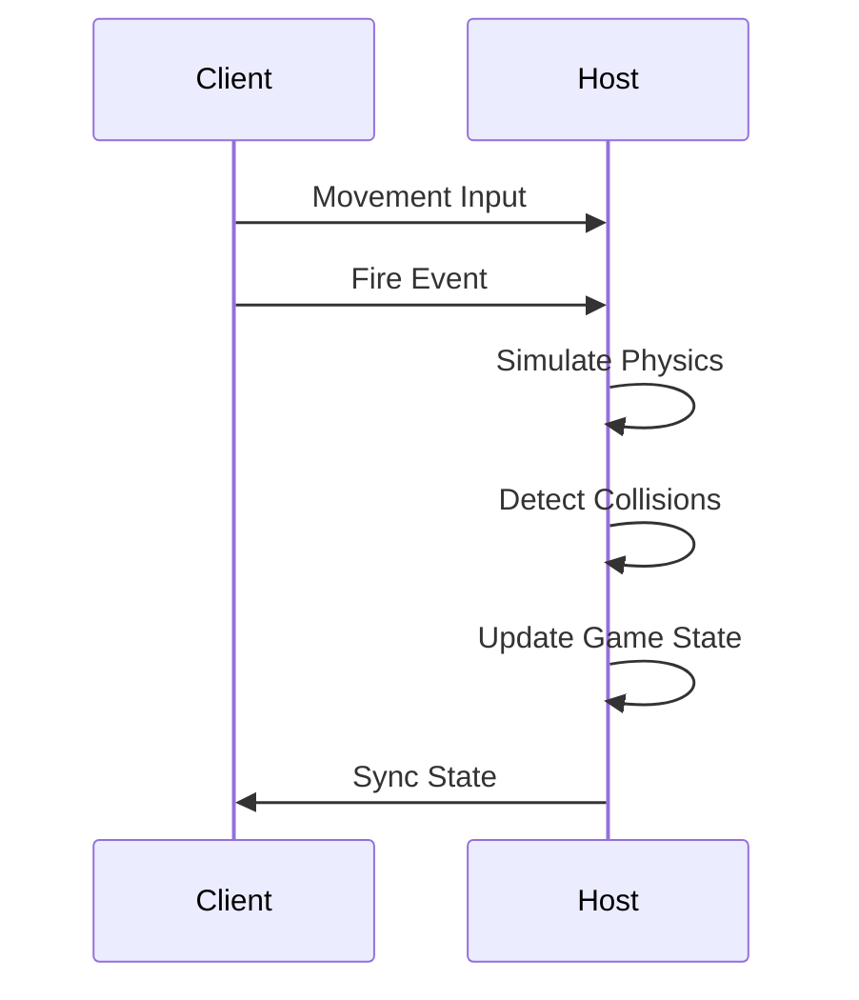

<h1>
  
  Phewland — Multiplayer 3D Shooter Playground
</h1>

> **Phewland** is a browser‑based **multiplayer 3D shooter playground** built with **React, Three.js, and peer‑to‑peer networking** — no backend server required.

A fast‑paced experimental third‑person shooter that runs entirely in the browser, combining modern React tooling, real‑time physics, and host‑authoritative multiplayer.

---

## 📛 Badges


[](./LICENSE)

---

## 🖼️ Preview



---

## 🧠 What This Project Is

- 🎯 Real‑time multiplayer shooter
- 🌐 Fully browser‑based (WebGL + WebRTC)
- 🚫 No traditional backend server
- 🧱 Host‑authoritative peer synchronization
- ⚙️ Physics‑driven gameplay
- 🧪 Designed as:
  - A game prototype
  - A React‑Three‑Fiber reference
  - A multiplayer architecture experiment

---

## ✨ Features

- 🔫 Real‑time shooting with physics‑based bullets
- 🧍 Third‑person character controller
- 🌍 3D map & environment lighting
- 📡 Peer‑to‑peer multiplayer (PlayroomKit)
- 🏆 Live leaderboard (kills / deaths)
- 🎮 Joystick + keyboard support
- 💥 Hit effects & audio feedback
- 🖥️ Fullscreen gameplay

---

## 🛠 Tech Stack

### Frontend / Game Engine

- React 19
- TypeScript
- Vite
- Three.js
- @react-three/fiber
- @react-three/drei
- @react-three/postprocessing

### Physics

- Rapier Physics
- @react-three/rapier

### Multiplayer

- playroomkit
  - Player state synchronization
  - Host‑authoritative logic
  - Peer‑to‑peer networking
  - Input abstraction

### Styling & Assets

- Tailwind CSS
- GLTF / GLB 3D models
- Action audio (MP3)

---

## 🧩 Architecture Overview

Phewland uses a **host‑authoritative peer‑to‑peer model**:

- First player becomes the **host**
- Host simulates:
  - Physics
  - Bullets
  - Damage
  - Kills / deaths
- Other clients:
  - Send input
  - Receive synced state
- Rendering and controls are fully local

### High‑Level Architecture



---

## 🗂 Project Structure

```text
.
├── index.html
├── package.json
├── vite.config.ts
├── eslint.config.js
├── tsconfig*.json
├── public/
│   └── vite.svg
├── types/
│   └── global.d.ts
└── src/
    ├── main.tsx
    ├── App.tsx
    ├── index.css
    ├── assets/
    │   ├── audio/
    │   ├── models/
    │   └── index.ts
    └── components/
        ├── experience.tsx
        ├── map.tsx
        ├── leader-board.tsx
        ├── player-info.tsx
        ├── character-controller.tsx
        ├── character-soldier.tsx
        ├── crosshair.tsx
        ├── bullet.tsx
        └── bullet-hit.tsx
```

---

## 🧱 Core Modules Explained

### [`App.tsx`](./src/App.tsx)

- Initializes WebGL canvas
- Enables shadows & post‑processing
- Wraps the scene with physics & suspense

### [`experience.tsx`](./src/components/experience.tsx) (Game Orchestrator)

- Player join / leave handling
- Bullet lifecycle management
- Kill & death tracking
- Network synchronization
- Lighting & environment setup

### [`character-controller.tsx`](./src/components/character-controller.tsx.tsx)

- Movement & rotation
- Shooting logic
- Camera follow
- Health, death & respawn
- Collision damage detection

### [`bullet.tsx`](./src/components/bullet.tsx) & [`bullet-hit.tsx`](./src/components/bullet.tsx)

- Physics‑based bullets
- Host‑validated collisions
- Visual hit shards
- Automatic cleanup

### [`leader-board.tsx`](./src/components/leader-board.tsx)

- Live player list
- Kill / death stats
- Player colors & avatars
- Fullscreen toggle

---

## 🔁 Core Gameplay Flow



---

## 🎮 Controls

- **Move**: Keyboard or joystick
- **Aim**: Player rotation
- **Fire**: Shoot button
- **Fullscreen**: Top‑right icon

---

## 🚀 Getting Started

### Prerequisites

- Node.js **18+**
- npm / pnpm / yarn

### Installation

```bash
npm install
```

### Development

```bash
npm run dev
```

Open: http://localhost:5173

### Production Build

```bash
npm run build
npm run preview
```

## 🌐 Multiplayer Notes

- First player becomes host
- Host:
  - Controls physics
  - Validates hits
  - Updates scores
- No dedicated server
- If host disconnects → session resets

## ⚠️ Assumptions & Limitations

- No dedicated server
- No anti-cheat system
- Not suitable for large lobbies
- Experimental networking
- Browser performance dependent

## 📜 License

This project is licensed under the **MIT License**. See the [](./LICENSE) for details.
